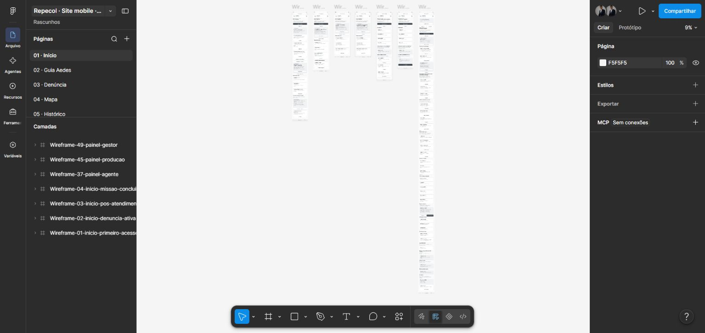

# Aedes Data Lab

**Status: concepção e wireframes de um site mobile.**

Aedes Data Lab é a nova proposta do Repecol, voltada à prevenção da dengue e à aproximação entre comunidade e equipes de atendimento. Neste estágio, o trabalho está concentrado na organização das jornadas e nas telas do Figma.

## Conheça o protótipo

[Abrir wireframes no Figma](https://www.figma.com/design/l2jRvkAj2tgcaD4RqnZD4Y?node-id=2010-2).

O arquivo do Figma utiliza o nome **Repecol**, projeto que originou a proposta **Aedes Data Lab**.

## Jornadas representadas

- Início, orientações e Guia Aedes.
- Denúncia de foco, localização no mapa e acompanhamento.
- Histórico, conversa com atendimento e notificações.
- Acesso, perfil e privacidade.
- Áreas de agentes, produção, distribuição e gestão.

As telas foram organizadas no Figma em 16 páginas por área. [Veja as exportações locais dos wireframes](wireframes/README.md).

## Estágio atual

Este repositório contém wireframes e imagens do protótipo visual. Os fluxos estão em fase de concepção; este repositório não contém uma aplicação implementada ou um backend.

## Autoria

João Vitor Regis · Aedes Data Lab / nova proposta do Repecol.
